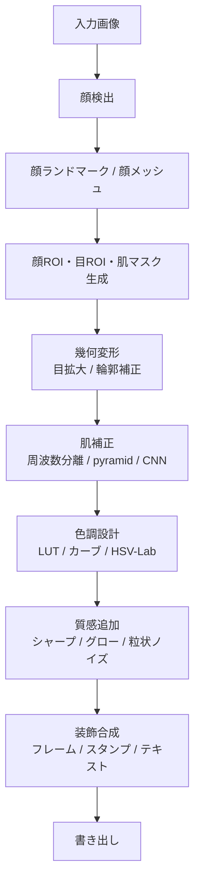
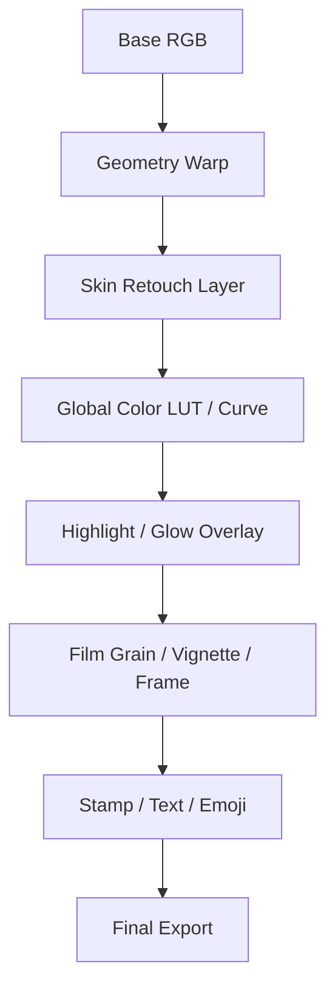

# 静止画をプリクラ風加工する画像処理アルゴリズムの実装者向け調査レポート

## エグゼクティブサマリ

静止画を「プリクラ風」に見せる処理は、単一のフィルタではなく、**顔形状の幾何変形**、**肌・質感の補正**、**色・コントラスト設計**、**グローや装飾の合成**を段階的に重ねるパイプラインとして実装するのが最も安定します。とくに「目を大きくする」「輪郭を細くする」は色補正では再現できず、顔ランドマークを用いた局所ワープが必須です。一方で、肌の滑らかさ、発色、ハイライト、フィルム風ノイズ、フレームやスタンプは、マスク付きのフィルタ処理とレイヤ合成で高い再現性を得られます。MediaPipe Face Mesh / Face Landmarker はモバイルでも実時間級の 468〜478 点ランドマークを扱え、dlib は 68 点の古典構成、face-alignment は 2D/3D 精度重視、OpenCV はブレンド・クローン・色変換の実装基盤として有力です。citeturn25view0turn25view1turn25view2turn24view0turn28view0turn26view3

実装方針としては、**軽量・堅牢な古典手法**と、**高画質な学習ベース手法**を役割分担させるのが現実的です。たとえば、顔検出・ランドマーク・ワープ・色調・合成は OpenCV / MediaPipe 系で処理し、肌補正や微細なレタッチだけを U-Net 系や GAN 系に限定すると、品質と処理速度のバランスを取りやすくなります。とくに学習ベースの色調処理では 3D LUT 系が非常に強力で、Image-Adaptive-3DLUT は 60 万未満のパラメータで 4K 画像を 2 ms 未満で処理したと報告しています。深層モデルの軽量化には LiteRT の事後量子化、ONNX Runtime の 8-bit 量子化、知識蒸留、縮小ランタイムが有効です。citeturn27view0turn27view3turn27view4turn28view2turn28view3

実務上の重要点は三つあります。第一に、**幾何変形後の境界破綻**を避けるため、変形は顔マスク内に限定し、周辺はフェザーまたは Poisson 系ブレンドで馴染ませること。第二に、**肌処理は周波数分離かピラミッド分解で“ディテールを残しつつ粗さだけを落とす”**こと。第三に、**評価は SSIM だけでなく LPIPS や主観評価を併用**することです。SSIM は「原画像と同一であるほど良い」指標なので、意図的に目や輪郭を変えるプリクラ風処理では単独採用に向きません。citeturn22view2turn26view3turn29search0turn29search9turn30search0turn21view5turn34view0turn34view1

本レポートでは、未指定要件を以下として扱います。

| 項目 | 状態 |
|---|---|
| リアルタイム性 | 未指定 |
| 対象プラットフォーム | 未指定 |
| 入力画像解像度 | 未指定 |

## 目的と視覚的特徴の定義

「プリクラ風」は、実装観点では**顔の可愛らしさを強調する局所形状編集**と、**透明感・高彩度・装飾性を持つ写真仕上げ**の組み合わせとして定義するのが扱いやすいです。幾何変形はアイキャッチ性を、肌補正と色補正は“盛れ感”を、スタンプ・フレーム・テキストは UI/体験らしさを担います。顔形状編集と色調編集を分離して設計すると、各処理の強度を個別に制御しやすく、失敗時の原因究明も容易です。citeturn25view0turn24view0turn26view3turn33view0

| 効果 | 視覚的特徴 | 実装の中心 | 代表パラメータ例 |
|---|---|---|---|
| 目の拡大 | 黒目周辺が大きく、瞼形状は破綻しない | 眼球中心を基準にした局所ワープ、または眼周囲ランドマークを制御点にした TPS / MLS | 拡大量 `α = 0.08〜0.20`、半径 `R = 1.1〜1.5 × 眼幅` |
| 輪郭補正 | 頬・顎がやや細く、鼻・口の位置は保つ | 顎・頬ランドマークの法線方向移動＋顔内ワープ | 収縮量 `λ = 2〜8 px` 相当 |
| 肌の滑らかさ | 毛穴・小さな色むらは減るが、輪郭・目・眉・唇は保つ | 肌マスク + 周波数分離 / bilateral / guided / pyramid / CNN | ぼかし `σ=2〜8`、ディテール保持率 `η=0.7〜1.0` |
| 色調・コントラスト | 明るめ、彩度やや高め、白肌寄り、黒つぶれ少なめ | LUT、トーンカーブ、HSV/Lab 補正 | `γ=0.9〜1.05`、彩度 `+5〜+20%` |
| 光沢・ハイライト | 頬・鼻筋に柔らかな艶、全体に軽い bloom | 輝度抽出 + blur + screen/add | 閾値 `t=0.75〜0.90`、blur `σ=6〜20` |
| フィルム風ノイズ・フレーム | 擬似アナログ感、UI らしさ | 粒状ノイズ、周辺減光、PNG フレーム重畳 | 粒状ノイズ `0.5〜2%` |
| スタンプ・テキスト | 装飾、感情表現、ブランド感 | RGBA レイヤ、回転・拡大縮小・アンカー固定 | 不透明度 `0.5〜1.0` |

プリクラ風で重要なのは、**「全画面一様に強く加工しない」**ことです。目や輪郭は局所変形、肌は肌領域だけ、ハイライトは高輝度領域か頬の ROI だけ、スタンプはレイヤとして別処理にすると、スマホアプリらしい自然な仕上がりになります。逆に、全顔に均一な強平滑化をかけると、AutoRetouch が指摘するように、識別的な肌ディテールまで失われやすく、人工感が急激に増します。citeturn34view2turn29search9turn30search0

## 推奨処理パイプライン

静止画向けの推奨パイプラインは以下です。ここでは、検出・幾何・質感・色・装飾を明確に分割し、各段階でマスクとレイヤを維持する構成を前提にします。MediaPipe Face Mesh は 468 点の 3D 顔ランドマークをリアルタイムに出力し、Iris パイプラインでは眼周囲が洗練された 478 点構成になります。Face Landmarker は画像・動画・ライブストリームの各モードを用意し、顔フィルタや変換行列の出力も持っています。citeturn25view0turn25view1turn25view2



設計の分岐としては、次の二系統が実用的です。

| 方針 | 推奨構成 | 長所 | 短所 |
|---|---|---|---|
| 古典手法中心 | MediaPipe / dlib + OpenCV + scikit-image TPS + bilateral/guided/pyramid | 実装が読みやすい、デバッグしやすい、軽い | 肌質感や色転びの上限がある |
| ハイブリッド | MediaPipe + OpenCV ワープ + CNN/U-Net/Retouch モデル + LUT | 品質を上げやすい、肌や色の一貫性が高い | 学習データ、推論環境、量子化が必要 |
| 学習主導 | 顔検出後に end-to-end retouch ネット + 補助ワープ | 見た目の統一感が出やすい | 制御しづらい、失敗時に局所修正しにくい |

顔と背景を丸ごと 1 モデルで変えるより、**幾何変形だけは明示的なワープで制御**し、**質感だけを学習ベースに任せる**方が、形の意図がズレにくいです。とくに MediaPipe は前フレームの結果を再利用する設計思想を持ち、ライブモードでは処理中フレームを捨てる挙動も明記されています。静止画処理でも、この発想を応用して、まず低解像度でランドマーク推定し、その後は高解像度の顔 ROI だけ精密処理する構成にすると効率が良いです。citeturn25view0turn25view2turn19search7

## 顔ランドマーク検出と幾何変形の実装詳細

### 推奨ライブラリ比較

| ライブラリ | 主な出力 | 強み | 弱み | 向く用途 |
|---|---|---|---|---|
| MediaPipe Face Mesh / Face Landmarker | 468 点顔メッシュ、Iris 併用で 478 点、表情 blendshape、変換行列 citeturn25view0turn25view1turn25view2 | モバイル実時間、密な点群、AR 向き | 点が多く後処理設計が必要、微小ジッタ対策が必要 | 目拡大、輪郭補正、スタンプ追従 |
| dlib | 68 点ランドマーク、HOG+線形分類器+画像ピラミッド、回帰木形状推定 citeturn24view0 | 軽量 CPU 実装、古典構成で理解しやすい | 正面顔寄り、点数が少ない | 最小構成の静止画実装、学習教材 |
| face-alignment | 2D/3D 顔ランドマーク、FAN ベース citeturn28view0 | 精度重視、3D あり、PyTorch で扱いやすい | MediaPipe より重い | 高画質オフライン処理 |
| OpenFace | ランドマーク、頭部姿勢、AU、視線、リアルタイム動作 citeturn28view1 | 研究用途が豊富、表情解析と併用しやすい | セットアップがやや重い、更新は古め | 表情連動エフェクト、研究プロトタイプ |

実装の出発点としては、**静止画 1 枚を確実に処理したいなら MediaPipe Face Landmarker**、**依存を減らしたいなら dlib**、**高画質・3D 整合性を意識するなら face-alignment**が無難です。顔検出だけ先に高速化したい場合、MediaPipe Face Detection は BlazeFace 系の超高速検出器で、6 ランドマークと複数顔対応を持ち、後段の Face Mesh などの ROI 生成に向きます。citeturn25view3turn25view0turn24view0turn28view0

### ワープ手法の比較

| 手法 | 数式 / 処理フロー | 利点 | 欠点 | 計算コストの目安 | 典型パラメータ |
|---|---|---|---|---|---|
| 放射状局所スケーリング | `p' = c + s(r)(p-c)`、`s(r)=1+α exp(-r²/2σ²)` など | 実装最小、目拡大に強い | 複雑な瞼形状に弱い | ROI ピクセル数に線形 | `α=0.08〜0.20, σ=0.35〜0.6R` |
| TPS | `f(x)=a0+A x + Σ wi U(||x-ci||)`、薄板の曲げエネルギー最小化に相当 citeturn22view0turn32search7turn26view0 | 滑らか、少数の制御点でも自然 | 制御点増加で解が重い | 係数解法 `O(K^3)`、適用 `O(PK)` | `K=10〜40` |
| MLS | 各点 `v` ごとに重み付き最小二乗で局所的な affine / similarity / rigid 変換を解く。重み `wi = 1 / |pi-v|^{2α}` citeturn20view1turn22view1 | 局所スケール・せん断を抑えやすい、自然 | 実装が TPS より少し複雑 | `O(PK)`、ただし 2×2 系で高速 | `α=1〜2` |
| Piecewise affine | 三角形分割→各三角形を affine warp | 高速、安定 | 境界に折れ目が出やすい | `O(P)` | 三角形密度依存 |
| Poisson / seamless clone | ワープ後領域を境界条件付きで馴染ませる。`min ∫|∇f-v|²`、`Δf = div v` citeturn21view2turn22view2turn26view3 | 境界破綻を隠せる、貼り込みが自然 | 幾何変形そのものはしない | 領域サイズとソルバ依存 | NORMAL / MIXED / MONOCHROME |

重要なのは、**TPS と MLS は「変形」、Poisson と seamlessClone は「馴染ませ」**であり、代替関係ではないことです。プリクラ風の顔加工では、**顔そのものは TPS / MLS / 放射ワープで動かし、境界や装飾の貼り込みは Poisson 系で処理する**のが正しい分担です。OpenCV の `seamlessClone` は `NORMAL_CLONE`、`MIXED_CLONE`、`MONOCHROME_TRANSFER` を提供し、`textureFlattening` や `illuminationChange` も同系統の局所編集関数として使えます。なお OpenCV のクローンは「ソース色がデスティネーション色に近いこと」を前提とする注意点があります。citeturn26view3turn22view2

### 目の拡大の実装

目拡大は、実用上は次の二段階で安定します。

まず、左右眼の中心 `c_l, c_r` と眼幅 `w_eye` をランドマークから計算します。MediaPipe なら 468/478 点から眼輪郭を、dlib なら 6 点の眼ランドマーク群を使います。つぎに、局所ワープを眼周囲楕円 ROI にだけ適用し、まつ毛・眉・鼻筋への影響をマスクで制限します。citeturn25view0turn25view1turn24view0

数式としては、最も実装しやすいのは**逆写像**です。目的画素 `p_d` から元画像の参照位置 `p_s` を求めます。

\[
r=\frac{\|p_d-c\|}{R}, \quad
s(r)=1+\alpha(1-r)^\beta \;\; (r<1), \quad
p_s=c+\frac{p_d-c}{s(r)}
\]

ここで `R` は眼 ROI 半径、`α` は拡大量、`β` は境界の滑らかさです。境界を自然にするには `β=2〜3` が使いやすく、両目で別々に処理し、最後に顔全体へ remap します。**前向き写像では穴が空きやすいので逆写像 + 双線形補間**が基本です。

```python
import numpy as np
import cv2

def local_eye_warp_inverse_map(map_x, map_y, center, radius, alpha, beta=2.5):
    cx, cy = center
    x0 = max(int(cx - radius), 0)
    x1 = min(int(cx + radius) + 1, map_x.shape[1])
    y0 = max(int(cy - radius), 0)
    y1 = min(int(cy + radius) + 1, map_x.shape[0])

    for y in range(y0, y1):
        for x in range(x0, x1):
            dx, dy = x - cx, y - cy
            r = np.sqrt(dx * dx + dy * dy) / radius
            if r < 1.0:
                s = 1.0 + alpha * ((1.0 - r) ** beta)
                map_x[y, x] = cx + dx / s
                map_y[y, x] = cy + dy / s

def warp_with_eye_enlarge(img, centers, radii, alpha=0.15):
    h, w = img.shape[:2]
    grid_x, grid_y = np.meshgrid(np.arange(w, dtype=np.float32),
                                 np.arange(h, dtype=np.float32))
    map_x = grid_x.copy()
    map_y = grid_y.copy()

    for c, r in zip(centers, radii):
        local_eye_warp_inverse_map(map_x, map_y, c, r, alpha)

    return cv2.remap(img, map_x, map_y, interpolation=cv2.INTER_LINEAR,
                     borderMode=cv2.BORDER_REFLECT101)
```

放射ワープだけで不自然になる場合は、**目頭・目尻・上下瞼のランドマークを制御点にした TPS / MLS**に移行します。具体的には、黒目中心付近だけを外へ押し、目頭・目尻は固定、瞼中央はわずかに持ち上げる、という制御点配置にすると「黒目だけ巨大で瞼が追従しない」破綻を抑えられます。TPS は薄板スプラインで滑らかさを担保し、MLS は局所剛体性を保ちやすいので、**目だけなら TPS、輪郭まで含めるなら similarity-MLS**が扱いやすいです。citeturn22view0turn22view1turn26view0

### 輪郭補正の実装

輪郭補正では、顎線・頬骨下・こめかみ付近のランドマークを**顔中心へ法線方向に少しだけ寄せる**のが基本です。局所変位量は一様にしない方が自然で、顎先は小さめ、頬中部はやや大きめ、鼻・口・目の周辺は固定点として残すのが安定します。変位後座標 `q_i = p_i - \lambda_i n_i` を作ったあと、顔マスク内で TPS または MLS を解き、ワープ結果を適用します。citeturn22view0turn22view1

TPS の典型形は、制御点 `P_i` と対応点 `P'_i` を用いて

\[
f(x, y)=a_1+a_x x+a_y y+\sum_{i=1}^{n} w_i\,U\!\left(\left\|P_i-(x,y)\right\|\right)
\]

で与えられ、薄板の曲げエネルギーを最小化する滑らかな変形になります。Bookstein 論文の行列表現は、対応点行列と多項式項をまとめた連立解で係数を求める構成です。実装では scikit-image 0.24 以降の `ThinPlateSplineTransform` を使うのが簡単です。citeturn22view0turn26view1turn26view0

```python
# scikit-image 0.24+ の例
import numpy as np
from skimage.transform import ThinPlateSplineTransform, warp

def tps_warp_image(img, src_pts, dst_pts):
    # warp() は inverse_map を期待するので dst->src を推定する
    tps = ThinPlateSplineTransform()
    tps.estimate(np.asarray(dst_pts, np.float64),
                 np.asarray(src_pts, np.float64))
    out = warp(img, tps, preserve_range=True)
    return out.astype(img.dtype)
```

MLS は Schaefer らの式に基づき、各評価点 `v` で制御点に応じた重み付き最小二乗を解く方法です。論文は similarity / rigid 版の閉形式を与えており、三角形分割なしで滑らかな変形を得られる点が利点です。顔輪郭のように**大局的には滑らかだが局所的な面積変化を抑えたい**タスクでは、TPS よりも MLS の方が「頬だけ急に縮む」ような不自然なスケーリングを抑えやすいことがあります。citeturn20view1turn22view1

## 美肌・肌トーン処理と色調・フィルタ設計

### 肌補正アルゴリズムの比較

| 手法 | 概要 / 数式 | 利点 | 欠点 | 計算コスト | パラメータ例 |
|---|---|---|---|---|---|
| Bilateral filter | `I'(p)=1/W_p Σ_q G_s(||p-q||)G_r(|I_p-I_q|)I_q`。エッジ保持平滑化 citeturn29search9turn29search2 | 速い、実装容易、輪郭保持 | 強くするとプラスチック肌 | 画像サイズに線形だが窓依存 | `d=5〜11`, `σColor=15〜40`, `σSpace=3〜8` |
| Guided filter | 局所線形モデルに基づくエッジ保持平滑化、O(N) 実装可能 citeturn30search0turn30search3 | ハローが少ない、速い | 皮膚だけの対象化にはマスク必須 | `O(N)` | `r=4〜16`, `ε=1e-4〜1e-2` |
| 周波数分離 | `I=L+H`, `L=Gσ*I`, `H=I-L`。低周波のみ平滑化 | 仕上がりを細かく制御できる | 肌マスクが甘いと眉・唇が崩れる | 低〜中 | `σ=2〜7`, `η_H=0.8〜1.0` |
| Gaussian / Laplacian pyramid | `G_{l+1}=down(B*G_l)`, `L_l = G_l - up(G_{l+1})`。粗い階層だけ修正 citeturn29search0turn3search0 | 粗い色むらと微細ディテールを分離しやすい | 実装がやや長い | 中 | `levels=3〜5` |
| CNN / U-Net retouch | 原画像→レタッチ画像の写像を学習。Pix2Pix 系は U-Net + PatchGAN が典型 citeturn34view2turn5search7 | 高品質、ニキビや色むらに強い | データ依存、重い | 中〜高 | 512px パッチ学習 |
| GAN / diffusion retouch | BeautyGAN は dual input/output GAN、近年は拡散系も登場 citeturn38search3turn38search6turn35view0 | 質感・色の完成度が高い | 制御性、速度、データ、推論環境が課題 | 高 | 条件ラベル・参照画像依存 |

### 古典美肌の実装フロー

実装しやすく破綻しにくいのは、**肌マスクつき周波数分離**です。まず skin mask `M` を作り、低周波 `L` と高周波 `H` に分けます。肌領域だけ `L` を guided / bilateral / pyramid で平滑化し、`H` は弱めるかそのまま残します。

\[
I = L + H,\quad
L = G_\sigma * I,\quad
H = I - L
\]

\[
I' = (1-M)\odot I + M\odot \left(L' + \eta H\right)
\]

ここで `L'` は平滑化後の低周波、`η` はディテール保持率です。`η=1.0` に近いほど毛穴を残し、`η=0.7` 前後まで下げると強い美肌になります。guided filter は bilateral よりハローが少なく、O(N) 実装もあるため、実運用では guided を第一候補、bilateral を簡易版と考えるのが妥当です。citeturn30search0turn30search3turn29search9turn29search0

OpenCV には Poisson 系の `textureFlattening()` もあり、選択領域内部のテクスチャを洗い流し、エッジだけを残して再積分する実装が利用できます。肌領域の荒れを強く落としたい場合の簡易手段ですが、やりすぎると“塗った感”が出やすいので、顔全体ではなく**頬・額の限定 ROI**に使う方が安全です。citeturn26view3

### 深層学習ベース美肌のトレードオフ

AutoRetouch は、実務的な高解像度顔レタッチに対して、**24MP の浮動小数表現では 250MB 超のメモリ**が必要になりうること、かつ高解像度でも識別的な肌ディテールを壊さないことが重要だと指摘しています。また FFHQR という大規模な professionally retouched dataset を公開し、従来の“blind smoothing”がほくろやそばかすまで消しやすい問題を示しています。これは、美肌モデルで最も重要なのが**「ノイズ除去」ではなく「識別的特徴を残したレタッチ」**であることを意味します。citeturn34view2

実装レベルでは、U-Net / Pix2Pix 型の生成器に対し、`L1 + perceptual + identity + adversarial` を組み合わせる設計が扱いやすいです。BeautyGAN 系はメイク転写の文脈ですが、**局所色成分を扱う dual input/output GAN** として非常に参考になります。近年では拡散系の face retouching も登場し、ICCV 2025 の手法は 25,000 組の before/after 高品質ペアを用意し、frequency selection/restoration と multi-resolution fusion により、全体整合性と局所ディテール保存を両立させています。citeturn38search3turn38search6turn35view0

学習データについては、**単なる before/after ペアだけでは不十分**です。ラベル付きデータがあると、目拡大・顔痩せ・肌平滑化などの操作強度を制御しやすくなります。RetouchingFFHQ を使った reversion 研究では、eye enlarging、face lifting、smoothing skin の 3 操作を 0〜3 段階でラベル化しており、操作強度の条件付けが可能です。逆に、データ分布が偏ると「特定の肌色・年齢・照明条件でだけ良く見える」モデルになりやすいため、FFHQ/FFHQR のように年齢・民族・照明の多様性があるデータを基準にするべきです。citeturn35view1turn34view2

### リアルタイム化・軽量化

軽量化では、まず**顔 ROI だけを処理**することが最も効きます。その上で、学習モデルを使うなら LiteRT の post-training quantization で動的量子化なら約 4 倍小型化・ 2〜3 倍高速化、full integer quantization なら 4 倍小型化・ 3 倍超高速化が案内されています。ONNX Runtime でも 8-bit 線形量子化をサポートし、`val_fp32 = scale * (val_quantized - zero_point)` の形で変換します。さらに知識蒸留は、**推論時の forward cost を増やさず小型モデルの性能を底上げ**する定番手法です。縮小ランタイムが必要なら、ONNX Runtime の reduced operator config で必要演算子だけを含むビルドにできます。citeturn27view3turn27view4turn28view2turn28view3

### 色調補正と LUT 設計

色調処理は、**ルックを 1D LUT / 3D LUT / トーンカーブ / 色空間操作のいずれで表すか**を先に決めると設計しやすくなります。OpenCV の `cvtColor` は色空間変換の基本 API で、HSV や Lab を含む多くの変換コードを持ちます。OpenCV 系の LUT 実装では、8-bit 入力に対して 256 要素の look-up table が基本です。一方で 3D LUT は RGB 3 軸の格子点に色変換を保存し、トリリニア補間で連続色を得るため、単純なトーンカーブだけでなく**色相依存の微妙な発色差**まで表現できます。OCIO は LUT を含むカラーマネジメント全体の標準的枠組みとして有用です。citeturn31search1turn31search6turn9search14turn27view1turn27view0

1D LUT は各チャンネル独立に

\[
y_c = \mathrm{LUT}_c[x_c]
\]

と書けます。トーンカーブはたとえばガンマ補正

\[
y = 255\left(\frac{x}{255}\right)^\gamma
\]

や、S 字カーブ

\[
y = \frac{1}{1+\exp(-k(x-x_0))}
\]

を 0〜255 に再スケールして LUT に焼けば実装できます。3D LUT では、正規化 RGB `(r,g,b)` を立方格子 `(u,v,w)` に写し、8 つの近傍格子点でトリリニア補間します。学習型 3D LUT は、Image-Adaptive-3DLUT のように**複数 basis LUT を小さな CNN で混合係数予測**する構成が有効です。citeturn27view0turn9search14turn27view2

色空間ごとの使い分けは、**HSV は Hue/Saturation 分離が簡単**、**Lab は明度 `L*` と色差 `a*, b*` が分離されて肌色管理がしやすい**、という理解で良いです。肌の透明感を出したいときは `L*` を上げつつ `b*` を少し下げて黄ばみを抑える、血色を足したいときは `a*` をわずかに上げる、ポップ感を出したいときは HSV の `S` を上げる、という設計が扱いやすいです。citeturn31search1turn31search6

### プリセット設計例

以下は実装者向けの**推奨プリセット例**です。これは文献の固定値ではなく、実装を開始するための設計テンプレートです。

| プリセット名 | 目的 | 幾何 | 肌 | 色 | 質感 |
|---|---|---|---|---|---|
| ナチュラル盛れ | 目立ちすぎない可愛さ | 目 `+10%`、輪郭 `-2〜3px` | guided 弱 | `L* +4`, `S +8%`, `γ=0.98` | 軽い unsharp |
| 透明感クール | 白肌・青み寄り | 目 `+8%` | 周波数分離中 | `L* +8`, `b* -3`, `S +4%` | 微グロー |
| いちごミルク | 甘め・ピンク寄り | 目 `+12%`、頬を少し丸く | guided 中 | `a* +2`, `b* -1`, 彩度 `+12%` | ほほハイライト |
| フィルムポップ | 粒状感・懐かしさ | 幾何は弱め | 肌弱 | 黒レベル少し持ち上げ、彩度 `-5%` | 粒状ノイズ、周辺減光、フレーム |
| 夜景ネオン | 発色重視 | 目 `+10%` | 肌中 | シャドウ持ち上げ、青紫ハイライト | bloom 強め、screen overlay |

コントラストとシャープネスは、顔全体よりも**目・まつ毛・虹彩のみ別マスクで強める**とプリクラらしさが増します。Unsharp masking は

\[
I' = I + \lambda (I - G_\sigma * I)
\]

で十分です。目のシャープ係数 `\lambda=0.3〜0.8`、肌のシャープ係数は 0 付近か負側にします。よりソフトな艶を出したいときは、高輝度マスク `B = \mathbf{1}(Y>t)` を作って blur し、screen か add で戻します。citeturn27view2turn33view0

## 合成とレイヤ管理

### アルファ合成とブレンドモード

非破壊編集では、各処理を「画像を直接上書きするのではなく、**レイヤ + マスク + パラメータ**」として持つのが基本です。単純な source-over 合成は Porter–Duff / W3C の式に従い、前景色 `Cs`、背景色 `Cb`、前景アルファ `αs`、背景アルファ `αb` に対して

\[
c_o = \alpha_s C_s + \alpha_b C_b(1-\alpha_s), \quad
\alpha_o = \alpha_s + \alpha_b(1-\alpha_s)
\]

で表せます。ブラウザ仕様書レベルでもこの形が整理されており、UI レイヤや PNG スタンプの基本合成はここから実装できます。citeturn33view0turn22view4

ブレンドモードは、色の“馴染み方”を決める重要要素です。W3C 仕様は、まず混色 `B(Cb, Cs)` を計算し、その後に合成すると整理しています。プリクラ風では Multiply / Screen / Overlay / Soft Light が使いやすく、特にグローやライトリークは Screen、フィルムフレームや色被りは Soft Light か Overlay が扱いやすいです。citeturn33view0

| モード | 用途 | 近似式 |
|---|---|---|
| Normal | PNG スタンプ、文字、フレーム | source-over |
| Multiply | 影、色締め、紙質感 | `C = Cb * Cs` |
| Screen | グロー、ライトリーク、きらめき | `C = 1 - (1-Cb)(1-Cs)` |
| Overlay | ポップな色被り | `C = 2CbCs` or `1-2(1-Cb)(1-Cs)` |
| Soft Light | 柔らかい色味のせ | 実装差があるが Screen と Multiply の中間 |

### 推奨レイヤ順序

プリクラ風では、以下の順序が安定します。



この順序にする理由は、**幾何変形を最初に済ませる**ことで後段の色・肌・装飾を“最終形状”に対して掛けられるからです。スタンプを先に貼るとワープで歪みますし、肌補正を先に強くかけるとワープ後にぼけが再強調されます。局所貼り込みが必要な場合は `seamlessClone()` を、単純な重畳でよい場合は RGBA 合成を使い分けます。特に髪飾り・ハート・頬シールのような周辺演出は alpha 合成で十分ですが、顔表面のグリッターや頬チークのように肌色へ馴染ませたい装飾は Poisson 系が効きます。citeturn26view3turn33view0

### 非破壊編集ワークフローの実装例

実装では、各レイヤを次のような JSON / dataclass で管理すると保守しやすくなります。

```python
layers = [
    {"type": "geometry", "name": "eye_enlarge", "mask": "eyes", "params": {"alpha": 0.13}},
    {"type": "geometry", "name": "jaw_slim", "mask": "face", "params": {"lambda_px": 4}},
    {"type": "retouch",  "name": "skin_fs",   "mask": "skin", "params": {"sigma": 4, "detail_keep": 0.9}},
    {"type": "color",    "name": "preset",    "mask": "all",  "params": {"lut": "strawberry_milk"}},
    {"type": "fx",       "name": "glow",      "mask": "face", "params": {"threshold": 0.82, "blur": 12}},
    {"type": "overlay",  "name": "frame",     "mask": "all",  "params": {"opacity": 1.0}},
    {"type": "overlay",  "name": "stamp",     "mask": "all",  "params": {"anchor": "right_cheek", "scale": 0.35}},
]
```

スタンプやテキストのアンカー位置は、固定ピクセルではなく**ランドマーク相対座標**で持つと便利です。Face Landmarker は顔変換行列も返せるため、頬・額・顎先・目尻などの基準点に対して装飾を追従させる設計がしやすくなります。静止画でも、複数顔や顔向きの違いを吸収するために、この相対基準は有効です。citeturn25view2turn25view0

## 実装例とオープンソース

### 参考になる既存実装

| プロジェクト | 位置づけ | 良い点 | 注意点 |
|---|---|---|---|
| MediaPipe Face Landmarker / Face Mesh 公式 | ランドマーク取得の第一候補 citeturn25view0turn25view2 | 468/478 点、Python サンプルあり、実時間設計 | 後処理のマスク・点群選択が必要 |
| dlib `face_landmark_detection.py` 公式例 | 最小の学習用構成 citeturn24view0 | HOG 検出 + 68 点推定が読みやすい | 付属モデルは iBUG 300-W 由来で商用注意 |
| `1adrianb/face-alignment` | 高精度 2D/3D ランドマーク citeturn28view0 | PyTorch ベース、高品質 | MediaPipe より重め |
| `TadasBaltrusaitis/OpenFace` | ランドマーク＋頭部姿勢＋視線 citeturn28view1 | 表情解析や gaze まで扱える | 研究コード色が強い |
| `wtjiang98/BeautyGAN_pytorch` | 公式 BeautyGAN 実装 citeturn14search11 | メイク転写系の参考実装 | 汎用美肌そのものではない |
| `HuiZeng/Image-Adaptive-3DLUT` | 高速色調補正の学習型 LUT citeturn27view0 | 高速・高解像度適性・実装公開 | LUT 学習の前処理が必要 |
| `yingqichao/retouching_FFHQ_detection` | RetouchingFFHQ 関連実装 citeturn23search10 | レタッチ強度ラベル付きタスクの参考 | 主目的は detection / reversion |
| `IngKP/AutomaticFaceSmoothing` / `5starkarma/face-smoothing` | 古典的美肌のミニマル例 citeturn14search9turn14search1 | bilateral + 顔検出で再現しやすい | 品質上限は低い |

最初に試すべき最小構成は、**MediaPipe でランドマーク取得 → OpenCV で eye warp / jaw warp → skin mask つき guided/bilateral → LUT/curve → alpha overlay**です。これでかなり“プリクラ風”に寄せられます。高画質化したくなったら、肌補正だけ AutoRetouch 系のネットに差し替えるか、色調だけ 3D LUT へ置き換えるのが拡張しやすいです。citeturn25view2turn26view3turn27view0turn34view2

### サンプルコードの参照ポイント

MediaPipe の Python ガイドは初期化コードが明快で、画像・動画・ライブストリームの違いも整理されています。dlib の例は 68 点モデルと HOG ベース検出の関係が分かりやすく、face-alignment は 2D/3D を数行で切り替えられます。LUT 系は Image-Adaptive-3DLUT が学習・推論・トリリニア補間周りを公開しており、Poisson 系は OpenCV の `seamlessClone` / `illuminationChange` / `textureFlattening` がすぐ試せます。citeturn25view2turn24view0turn28view0turn27view0turn26view3

## 性能評価と法的・倫理的注意点

### 視覚品質評価

SSIM は輝度・コントラスト・構造の比較に基づく古典指標であり、式は

\[
SSIM(x,y)=
\frac{(2\mu_x\mu_y+C_1)(2\sigma_{xy}+C_2)}
{(\mu_x^2+\mu_y^2+C_1)(\sigma_x^2+\sigma_y^2+C_2)}
\]

の形を取ります。一方 LPIPS は深層特徴空間での距離で、実装リポジトリでも「高いほど差が大きく、低いほど近い」と明記されています。両者は補完的で、**SSIM は構造保持、LPIPS は知覚差**を見るのに向きます。citeturn21view5turn34view0turn34view1

ただし、プリクラ風処理では目や輪郭を意図的に変えるため、原画像との SSIM は下がって当然です。そのため評価プロトコルは、**顔外背景の整合性**、**肌領域のテクスチャ保存**、**ランドマーク変位の妥当性**、**主観評価**を分けるべきです。Retouching reversion 研究では PSNR、SSIM、LPIPS に加え、ランドマーク平均距離 AvgD を使って形状変化の戻り具合を測っています。これを逆に利用し、**望んだ変形量だけが入っているか**の指標として AvgD 相当を導入するのは有効です。citeturn35view1

### 推奨評価項目

| 項目 | 指標 | 何を見るか |
|---|---|---|
| 背景保持 | SSIM / PSNR on non-face mask | 顔以外を壊していないか |
| 顔知覚品質 | LPIPS on face ROI | “盛れ感”と不自然さのバランス |
| 形状制御 | ランドマーク移動量、AvgD 相当 | 目拡大量・輪郭収縮量の妥当性 |
| 肌品質 | 毛穴保持率、エッジ勾配、主観評価 | のっぺり感の有無 |
| UX 品質 | A/B テスト | ユーザが「プリクラっぽい」と感じるか |

### 処理速度目標とメモリ見積もり

ここは文献の固定値ではなく、**未指定要件に対する推奨目標**として示します。

| 環境 | 推奨目標 | 構成 |
|---|---|---|
| デスクトップ CPU | 1080p 静止画 100〜300 ms | 古典手法中心 |
| デスクトップ GPU | 1080p 静止画 20〜80 ms | ハイブリッド or 軽量 CNN |
| モバイル NPU/GPU | 1080p 静止画 80〜200 ms | MediaPipe + 量子化モデル |
| 高解像度オフライン | 12MP 以上で 0.3〜2 s | ROI 分割、3D LUT、必要なら CNN |

メモリは 1920×1080 の RGB8 画像 1 枚で約 6.2 MB、RGBA8 で約 8.3 MB、float32 1 チャンネルで約 8.3 MB、2 チャンネルの変位マップで約 16.6 MB です。したがって、原画像、ワープ結果、中間バッファ、マスク群、変位場を持つだけで 50〜120 MB 程度はすぐに使います。AutoRetouch も 24MP 浮動小数画像では 250MB 超を指摘しており、高解像度では**顔 ROI 処理・タイル処理・半精度化**が重要です。citeturn34view2

### 法的・倫理的注意点

日本の個人情報保護委員会の資料では、**特定個人を識別できるほど鮮明な顔画像**や、**顔特徴データ等**の取扱いには安全管理措置や説明可能性が重要であると整理されています。顔画像をアプリで加工・保存・共有する場合は、第三者の顔が写っていないか、元画像や特徴データをどう保管するか、利用目的をどう説明するかを明確にすべきです。citeturn12search8turn12search3turn12search0

また、dlib の 68 点学習済みモデルは iBUG 300-W 由来で、公式例でも**商用利用前にライセンス確認が必要**と明記されています。オープンソース実装をそのまま製品へ組み込む場合は、モデル重みのライセンス、学習データの利用条件、商用可否を必ず確認してください。citeturn24view0

倫理面では、顔レタッチは顔認識や本人性評価を難しくしうることが継続的に指摘されています。過度な加工は、プロフィール偽装、年齢・体型印象の不当操作、差別的な美的基準の強化にもつながりうるため、UI では**強度スライダの上限制御**、**加工のオン・オフ比較表示**、**保存前プレビュー**を用意するのが望ましいです。citeturn13search7turn13search4

### 実装上の最終推奨

最初の実装としては、以下の構成が最も成功率が高いです。

| 項目 | 推奨 |
|---|---|
| 顔検出 / ランドマーク | MediaPipe Face Landmarker |
| 目拡大 | 逆写像の局所放射ワープ、必要なら眼周囲 TPS |
| 輪郭補正 | 顎・頬ランドマークを similarity-MLS で内側へ |
| 肌補正 | 肌マスクつき guided filter + 周波数分離 |
| 色調 | Lab の `L* / a* / b*` 微調整 + 1D LUT、上位版は 3D LUT |
| ハイライト | 高輝度抽出 + Gaussian blur + Screen |
| 装飾 | RGBA レイヤ、顔表面だけ seamlessClone 併用 |
| 評価 | 背景 SSIM、顔 LPIPS、ランドマーク変位、主観 A/B |

この構成は、公式ライブラリの安定部品と主要研究の知見を組み合わせたもので、**プリクラ風らしさ・制御性・実装容易性**の三点で最もバランスが良いです。高品質化したくなった時だけ、肌補正や色変換を学習ベースへ段階置換するのが、実装コストと保守性の面でも推奨できます。citeturn25view2turn26view3turn27view0turn34view2